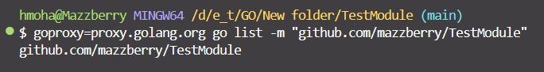

git tag v{}.{}.{}
git push origin main --tag
##to push the commit with tags

##after commit a message to staged flow(of git) and before push to repo, 
we can tag the version of my Public module 

with command : goproxy=proxy.golang.org go list -m "module address"

we could public the module in "https://pkg.go.dev/"